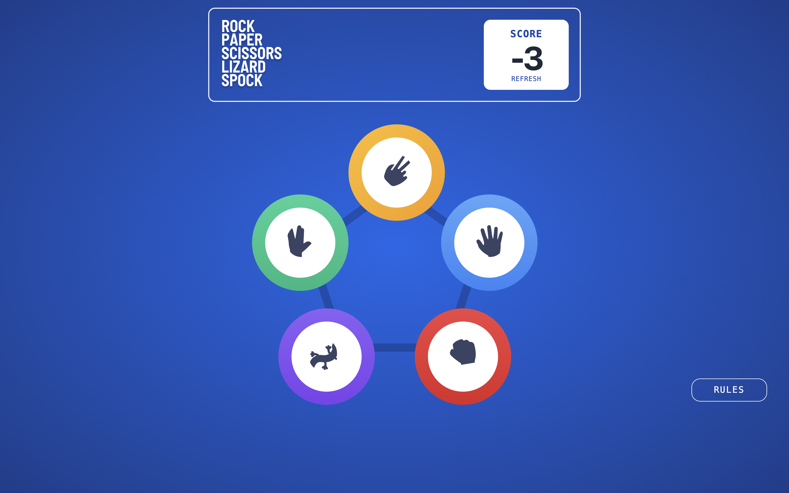
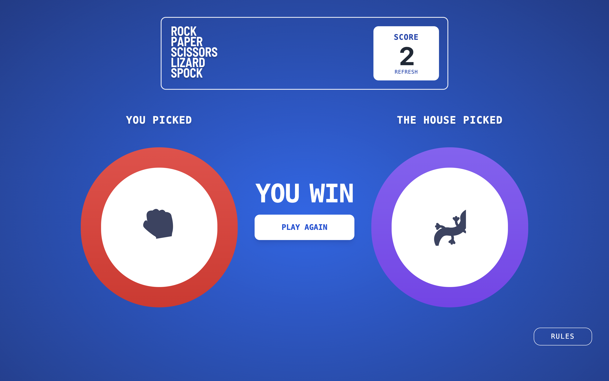
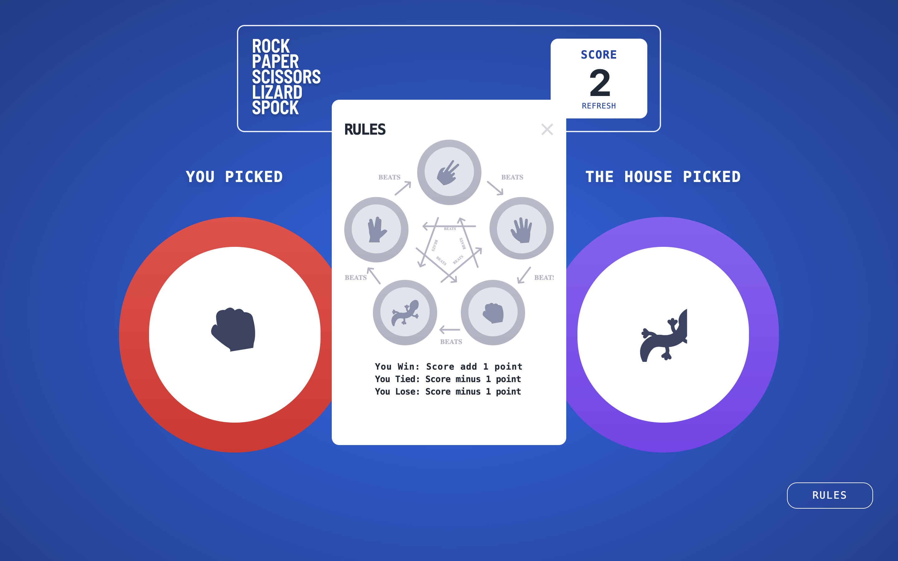

# Scissors-Paper-Rock-Spock-Lizard

This is a small web-app game created by Marshall

This game can lets user choose one of the Scissors,Rocks,Paper,Spock&Lizard and compare the choice to the House


## Technologies Used
- Generating using [Vue3] (https://v3.vuejs.org/)
- Using [Tailwindcss] for styling (https://tailwindcss.com/)
- [JavaScript] (https://developer.mozilla.org/en-US/docs/Web/JavaScript)
- [Firebase] for deployment (https://firebase.google.com/)

## Features
As a Player:
- I can choose one of the Scissors,Rocks,Paper,Spock&Lizard and compare the choice to the House
- Rule explaination: (./src/assets/images/image-rules-bonus.svg)

## Screenshot
Home:

Game:

Rules


## Setup

For Localhost

```
npm install
```

### Compiles and hot-reloads for development
```
npm run serve
```

Online Visit(https://scissors-paper-rock.web.app/)
## Structure

Virtual Dom Structure

Main entrance: ```src/App.vue```
               ```src/main.js```

Views are in the ```src/views ```
  - Home:  ```Home.vue```
  - Game: ```Game.vue```

Components in the ```src/components```
  - Banner: ```Banner.vue```
  - Combat: ```Combat.vue```
  - Result: ```Result.vue```
  - Rules:  ```Rules.vue```
  - Selection:  ```Selection.vue```
  - SelectionsList:  ```SelectionsList.vue```      

router is in the ```src/router```


